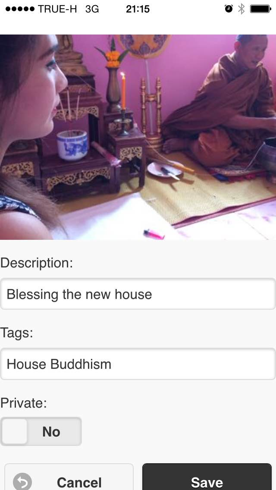
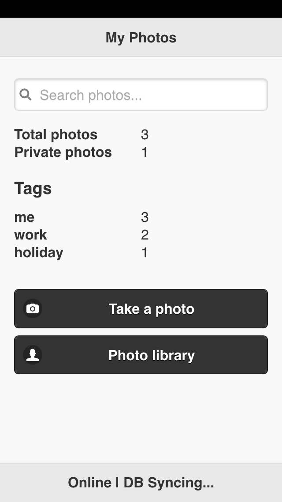

# Photo Share, the Mobile App

Photo Share is a simple photo sharing mobile app. It is quite simple: take photos with the camera, or choose them from your photo library. Write descriptions and some tags, and click save.

The purpose of Photo Share is to show developers how easy it is to make a mobile application that

* Has a relaxed, pleasant data store
* Supports powerful MongoDB-style querying (Cloudant Query)
* Runs just fine offline
* Syncs to the cloud (Cloudant) when online

When you describe, tag, and save a photo, by default Photo Share does nothing. However, using the Cloudant Query PouchDB plugin, we can trivially store, query, and sync our photos to a global database.

### Starting Up

## Before

## Add a new photo

## After

